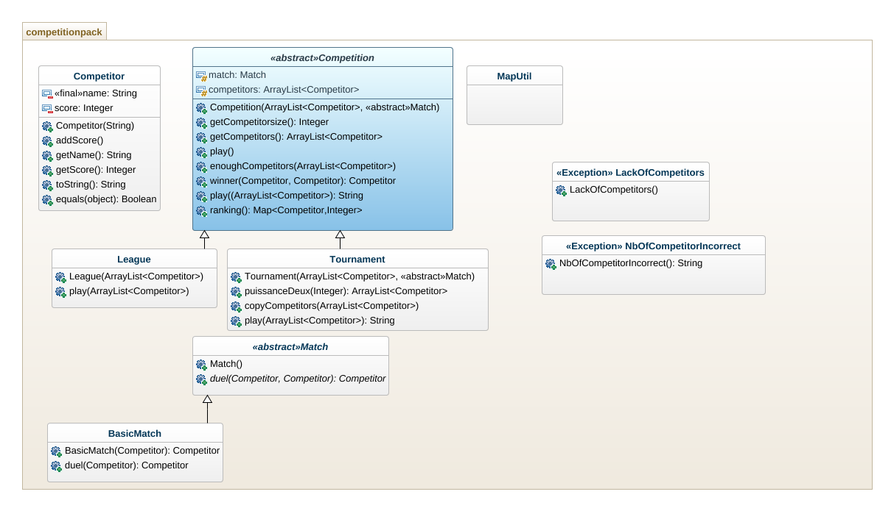

------------------------------------------------------------
# Projet COO : réalisé par : JOUHRI Toufik & JARIR Yassine.|
------------------------------------------------------------

# Objectifs :

Pour cette première partie du projet , Il fallait réalisé une competition en deux types de matches entre des participants qui s'affronteront entre eux pour soit être en premier grâce au score cumulé avec les victoires (le cas d'une league) ou soit finir en premier en gagnant tous les autres participants (le cas d'un tournois). Pour l'instant les matchs entre deux participants sont tout à fait aléatoire et non truqué , ce qui veut dire 50% de chance de gagner pour chacun d'eux.


## Howto :
# Récupération du dépôt :
```
git clone git@gitlab-etu.fil.univ-lille1.fr:jouhri/jouhri-jarir-coo-projet.git
```
or 
```
git clone https://gitlab-etu.fil.univ-lille1.fr/jouhri/jouhri-jarir-coo-projet.git
```

# compiler le projet :

grâce au terminal et à l'interieur du dossier "Jouhri-Jarir-COO-Projet/src" , éxecutez la ligne de commande si dessous qui va créer les fichiers .class dans le dossier classes  (qui vient d'être créer avec la commande)s :
```
javac competitionpack/*.java -d ../classes
```

# récupérer la JavaDoc :

-l'intérieur du dossier "Jouhri-Jarir-COO-Projet/src" , éxecutez la commande suivante qui génèrera la javadoc dans un dossier "docs"  :

```
javadoc -d ../docs -subpackages competitionpack

```
# Génération de l'archive du projet :

- Pour la génération de l'archive il faut être dans le dossier "Classes" générer par la complation:

```
jar cvfm ../competitionpack.jar ../manifest-sc competitionpack
```

# Executer l'archive :

-Retournez dans le répértoire "Jouhri-Jarir-COO-Projet" puis éxecutez la commande suivante :

```
java -jar competitionpack.jar
```

# Explications des choix pris lors du codage :
1/ la création d'une classe abstraite 'Match' nous faciliterait la tâche pour la suite du projet afin d'implémenter des nouveaux matchs autre que le match normal "BasicMatch".

2/ Création des deux exceptions ("LackOfCompetitors" et "NbOfCompetitorincorrect") afin de guider l'utilisateur en cas d'échec dans l'insertion d'une liste de participants dans n'importe quelle competition (league ou tournois).

3/ l'utilisation de Map pour faciliter la collection des scores et les trier en décroissant.

### UML :



