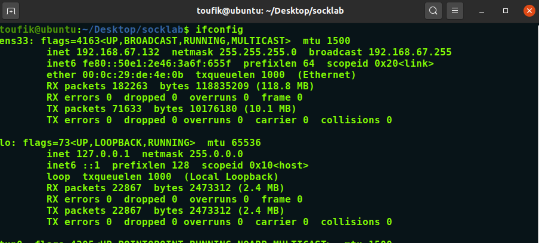
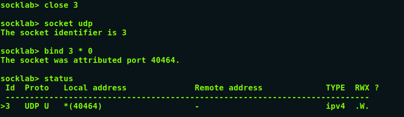
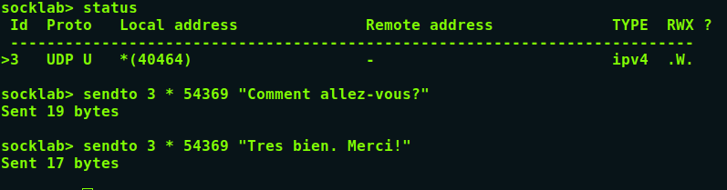
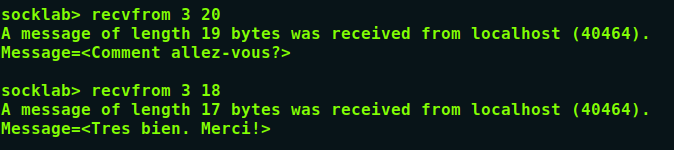
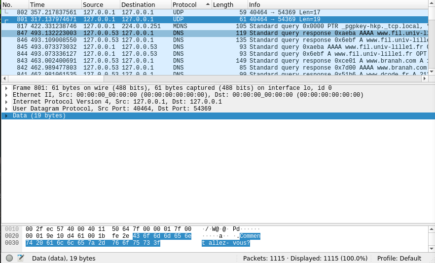
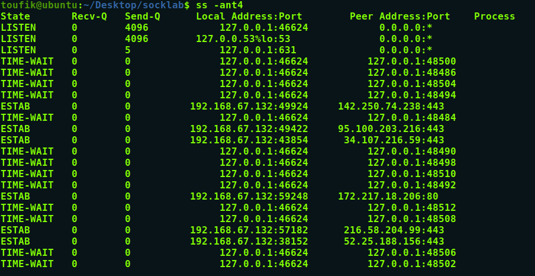
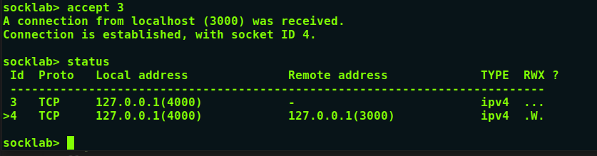
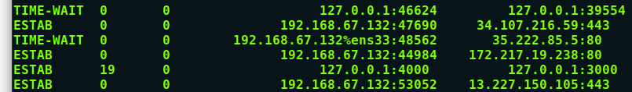
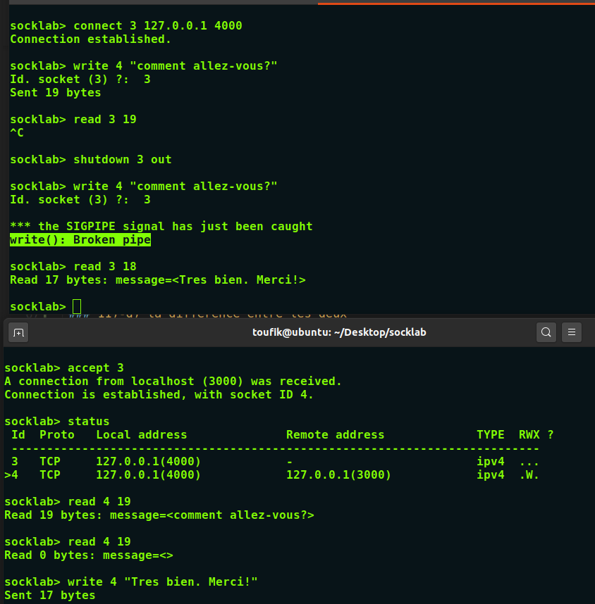
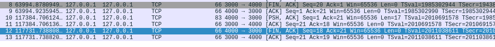

# Rapport pour le TP1

## Notez bien que les screenshots sont dans le dossier ./src dans le même répertoire du Readme.

### 1) IPv4 associée à l’interface ethernet(ens33) dans mon cas de mon ordinateur

	
_dont l'adress ipv4 associée à l'interface ens33: 192.168.67.132_

### 2) on lance la commande: socket udp:

### 3) la commande status :

### 4)5) la commande bind et sendto , ici j'envoie à mon localhost: 127.0.0.1

### vu que le weekend on a pas accés au ssh du M5:

### 6) les info qu'on a besoin : l'id du socket , ip du voisin , et le port

### 7) l'affichage du message recu chez le voisin

### 8) sur les deux : pour eviter tout conflis avec d'autres ports deja utilisé 

### 9)10)

### 11)12)13)14)

### 15)a) l'analyse du wireshark

1. le premier message de taille 19 bytes envoyé du port 40464 -->54369.
1. - la taille du packet est de 61 bytes capturé.
2. le deuxieme message de taille 17 bytes envoyé du port 40464-->54369.
2. - taille du packet est de 59 bytes capturé.
3. **par la suite on remarque qu'au millieu le bloc ressemble au modele osi TCP mais inversé**
4. et puis enfin on a le decodage hexa du code ascii envoyé.
5. dans le champ internet protocol version 4 , on a bien la bonne src et dst
	- pareil pour le port, et dans le dernier bloc on voit clairement le message envoyé.

### 15)b)c)

  - **On remarque deux segments UDP transmis car UDP ne fait qu'envoyer le package**

### 15)d) l'efficacité de udp :
  - pour le premier message sa taille est de : 19 bytes, et la taille pour vehuciler ce message est : 61 bytes.
  - d'ou le rapport 19/61*100 = 31,14%
  - pour le 2 éme message sa taille est de :  17 bytes, et la taille pour 
  vehuciler ce message est : 59.
  - d'ou le rapport 17/59*100 =  28,81%

### 16) on supprime les sockets : close 3 / close (server/client)

# 							Partie TCP

### 1) on ouvre 2 socket avec la commande socket tcp sur les deux terminals

### 2) sudo wireshark -i lo -f 'tcp port 3000' & :

### 3) la commande ss -ant4 :

### 4) on constate que la connexion à été refusé

### 5)6)7)on met S2 en listen, la demande de connexion est en attente,
 - la socket server est : S2
 - la socket client est : S1

### 8)9)10) on accepte la connexion et on remarque dans status qu'il y'a un nouveau socket, soit disant connexion etablis: 

 - avec le droit d'écriture "W".

 ### 11)11)-a analyse:
 
 - dans le wireshark ligne 4: apres avoir été accepté a se connecter avec S2[SYN,ACK]: S2 repond à S1 qu'il a recu son SYN et qu'il est OK pour la connexion.
 - S1 repond dans la ligne 5: avec un [ACK] qu'il confirme la connexion.
 - ligne 6 : S1 demande à S2 d'établir un buffer pour faire une real-time  connection pour informe le host que les données doivent être envoyer immédiatement à la couche application qui reçoit.
 - ligne 7 : S2 confirme avec un [ACK]

 ### 11)a- ce qui se passe s'il ne mets pas de PUSH 
 - pour ce packet rien ne va se passer, le message va arriver ,mais sur un grand message qui dépasse par exemple 1500 byte , le packet va être divisé par l'application qui envoie en plusieur packet par défaut car un  des  rôles  de  TCP  est  de  découper  un  message  trop long  afin  d'envoyer  des  segments  dont la taille soit égale au MSS du récepteur.

 ### 11)-b)-c) le numéro de séquence et le numéro d'acquittement. Le numéro de séquence représente le propre numéro de séquence de l'émetteur TCP, tandis que le numéro d'acquittement représente le numéro de séquence du destinataire.

 ### 11)-d) la difference entre les deux 

 ### 12) la commande:ss -ant4
 

 ### 13) id_socket est l’identifiant de socket renvoyé par la commande accept:
   - car on intercepte le message quand on met idsocket = 4 créer par accept.
   - ça nous affiche le message : comment allez vous

### 14) on lance ss -ant4 et cette fois-ci RecvQ = 0.

### 15)ligne 8 : [FIN,ACK] S1 Confirme  qu'il a recu le packet envoyé just 			avant et demande de fermer la connexion.apres avoir envoyer un autre 		 message depuis S1 et qu'on fait un read 4 19 : ça affiche read 0 bytes 		 donc la connexion a bien été fermé 

### 16) on envoie le message de S3 vers S1 en utilisant 

### 17) pareil comme la question 15 : ligne 12 et 13 , 4000 vers 3000 S3 demande à S1 de fermer la connexion avec un accusé de reception,puis S1 confirme avoir recu le packet. donc shutdown sert à fermer la connexion soit dans un sens ou les deux (in / out / both)

### 18) la taille totale est pour véhuciler le message est : 74+66+85+66 =291 la taille du message est : 19, on commence de ligne n°4 pour établir la connection entre le serveur et le client puis on envoie le message et enfin le serveur envoie un accusé de reception du packet qui contient le message: donc lefficacité est : 19/291= 6.52%
  - d'ou on constate que TCP est meilleur Que UDP car y'a pas de perte de packet au niveau de TCP et attends toujour un accusé de reception pour continuer , par contre UDP on sait pas si tout les packets sont arrivée ou il en manque.. enfin UDP ne vérifie pas la reception.

 
### 19) diagramme finale de communication.. j'ai mis FIN=1 (FLAG)par exemple juste pour preciser que c'est une fermeture de connexion. 
 

### Signature : Jouhri Toufik & yassine jarir
### Remarque : si vous êtes arrivé à ce stade, sachez que c'était fatiguant et long avec ce nouveau systeme comodale /inversé.
  - entre comprendre les TPs(Tout les Modules),préparer les cours, lire les documentations, rediger, pratiquer et rendre 4 à 5 TP par semaine.
### Merci pour votre Compréhension
### Cordialement.

